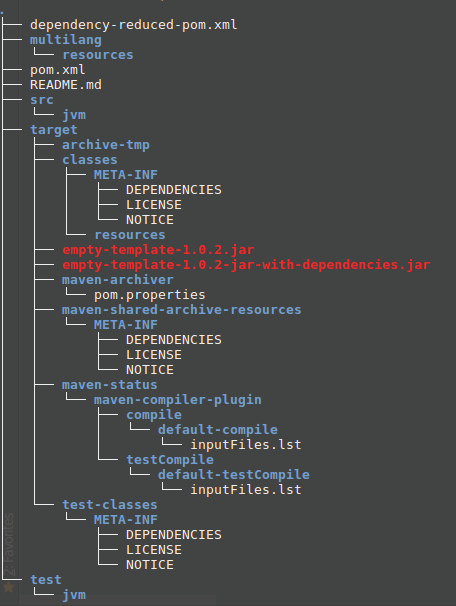

Empty storm template
====================

This template is used to create empty storm project. 
Copy all the contents of the root directory into your project directory and change the following items

1. Edit pom.xml in the / directory
   1. Change the value of artifactId to project name
   2. Change the value of name element to project name
   3. Change the value of groupId to root package name
2. Execute the following commands (assuming maven is already installed)
   1. `$mvn package`
3. Import this maven project into IntelliJ
4. create root package and start implementing spouts/bolts and topologies
5. Follow the following steps to run the project
   1. cd to / of project
   2. `$mvn package`
   3. From root dir execute the following command
      1. `$/path/to/storm/bin/storm jar target/projectname-jar-with-dependencies.jar package.of.mainclass.mainclass`
   4. After doing mvn package, this is how tree would look like
   5. 

## Creating project out of this template

1. Copy the contents of empty template into your project directory

   `$cp -rf /path/to/empty_storm_template /path/to/<projectname>`

2. Edit pom.xml under root to have your project name and your project package. Elements to edit are 

   1. groupId under project element
   2. artifactid under project element
   3. name element under project element

3. Execute `$mvn package`

## Import project into intelliJ

1. File - new - project from existing source
2. point to your project's root directory
3. In the next screen, import project from external model, select maven
4. In next screen, check "import maven projects automatically"
5. In select profiles, make sure you select intelliJ
6. click next => next => finish
