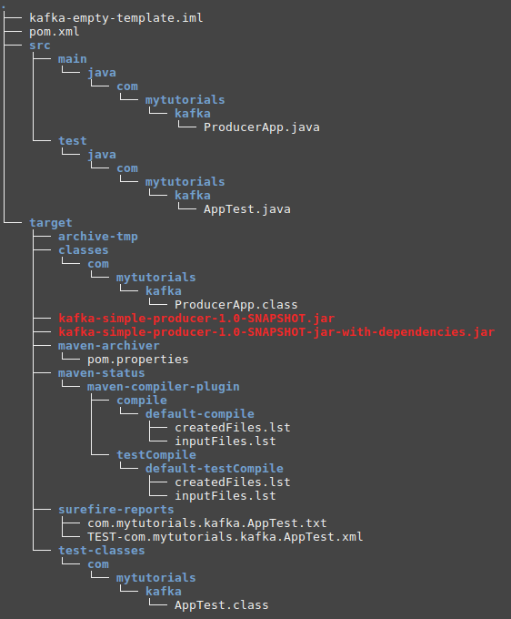

# Kafka empty template

This is used to start simple empty kafka project. It could be producer app or consumer app.

## Steps to start

1. Clone the project
2. Edit pom.xml and change artifactId and name
3. Change class name under /src/main/java/com/mytutorials/kafka/
4. Edit pom.xml and edit mainClass to match the name and package you are using
5. Do `mvn package`
6. Directory structure is shown below

7. Execute the following command to run the app from project's root directory

`java -jar target/your-app-jar-with-dependencies.jar`